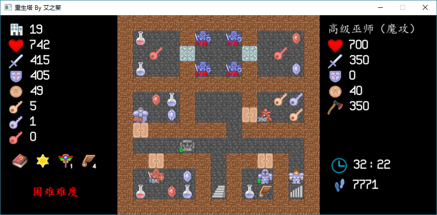

重生塔
================

### 游戏说明
此塔为一个蓝里透红向的塔，相比传统魔塔而言，比较考验智商。

本塔所有怪物都拥有重生属性。“重生”的意思是，当你在一场战斗中打败怪物后，如果不为无伤且你背后是空地，怪物将在你背后重生；重生后的怪物攻防血都是原本数值，但是打掉后获得的金币变成了一半（向下取整）。

本塔由C++编写而成，VS2012编译运行，支持Windows XP及以上系统运行。

本塔有如下特性：

  * 蓝里透红向的重生塔：如何克制乃至利用怪物的重生属性是本塔最大的亮点。
  * 游戏中存在三层的试炼之地，比较考验路线，也很有意思。
  * 有四种难度模式，三种不同结局，适合各阶段的玩家。
  * 达成任意一个结局后将会把你的成绩上传到服务器，与大家进行比较。同时按P键可以查看当前MAX。
  * 更多的特性期待你来发掘~

下载地址：https://tieba.baidu.com/p/5356252626

### 编译运行

请使用VS2012及以上进行编译运行。  
如果使用VS2015进行编译，请将 `legacy_stdio_definitions.lib` 加入到项目库中，以免发生 `error LNK2019: unresolved external symbol _sscanf` 错误。  
**请将hge文件夹下的所有`dll`文件，以及源代码目录下的`Res`和`Save`文件夹，复制到生成文件夹中，才可以正常进行运行游戏。**   
如果有问题，请联系 `ckcz123@126.com`。  
